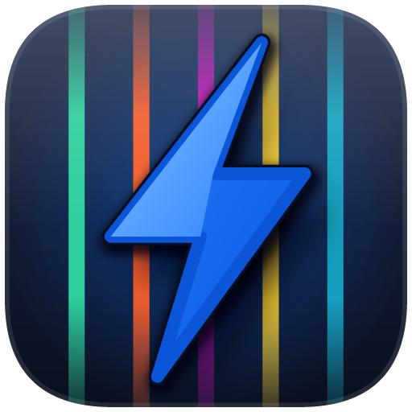
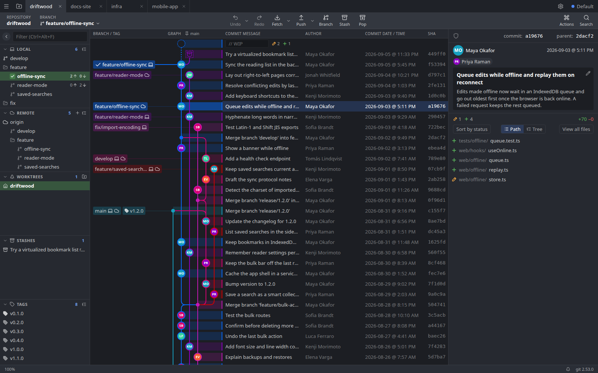

<p align="center">
  
</p>

<h1 align="center">GitBolt</h1>

<p align="center">A fast, keyboard-friendly desktop Git client with a commit graph at its heart.</p>

---

GitBolt is a graphical Git client inspired by [GitKraken](https://www.gitkraken.com/). If you've
used GitKraken, it'll feel familiar on purpose: the lane graph down the middle, the branch and
remote sidebar, the commit details on the right, and workflows driven from context menus and
the keyboard. GitBolt is an independent project, not affiliated with or endorsed
by GitKraken / Axosoft.

It's built with a Rust core (using [gitoxide](https://github.com/GitoxideLabs/gitoxide) for most reads
and the `git` CLI for writes, so your hooks, config and credentials behave exactly as they do in a
terminal), a React UI, and [Tauri](https://tauri.app/) with the Chromium (CEF) runtime.



> **Status:** early (0.x). Usable day to day on Linux, but expect rough edges.

## Platforms

| Platform | Status |
|---|---|
| Linux | Supported: `.deb` and Arch Linux packages |
| Windows | Planned |
| macOS | Planned |

## Features

### Where GitBolt goes further

- **Rendered Markdown diffs.** Read a changed `.md` file as rendered Markdown, inline or side by
  side, with the changed words highlighted. GitKraken renders Markdown in its file viewer, but
  not in diffs.
- **Undo history.** Each worktree keeps a journal of its last 50 operations, and it
  survives restarts: commits and amends, checkouts, branch and tag changes, merges, rebases,
  cherry-picks, reverts, resets, stashes, discards and pulls. Staging has its own undo too.
  GitKraken undoes the last action only.
- **Interactive rebase.** Besides pick, reword, squash and drop, GitBolt has fixup
  and edit (the rebase stops so you can amend that commit), predicts which commits will
  conflict before you start, and lets you move, add or delete branches on the rewritten commits
  in the same step.
- **Stacked MRs on GitLab too.** Create a whole stack of merge or pull requests at once, push
  and rebase the stack, and have the next one retargeted after a merge, on GitHub and GitLab
  (self-managed included). GitKraken's stacked pull requests work with GitHub.com only.
- **Automatic trunk pinning.** The graph keeps your main branch in the leftmost lane without
  being asked: the local branch that tracks the upstream's default branch, or in a fork, the
  original project's rather than your fork's.
- **Image diff modes:** side by side, swipe, onion skin and a pixel
  difference view, all with zoom.
- **Free and MIT licensed, private repos included.** No account and no telemetry. GitKraken's free
  plan covers local and public repos; private repos, multiple profiles and self-hosted forges
  need a paid plan.

### Compared with GitKraken

✅ yes, 🟡 partly, ❌ no.

| | GitKraken | GitBolt |
|---|---|---|
| Commit graph with lanes, branch/tag chips and avatars | ✅ | ✅ |
| Main branch pinned to the left | 🟡 When you pin one | ✅ Automatic, fork-aware; can be changed or turned off |
| Tabs, multiple repos, worktrees | ✅ | ✅ |
| Staging files, hunks and lines | ✅ | ✅ |
| Undo / redo | 🟡 Last action only | ✅ Last 50 operations, across restarts |
| Branches, tags, stashes, cherry-pick, revert, reset | ✅ | ✅ |
| Merge and rebase | ✅ | ✅ |
| Interactive rebase | 🟡 Pick, reword, squash, drop | ✅ Also fixup, edit, conflict prediction and branch moves |
| Merge conflict tool with an editable result | ✅ | ✅ |
| Push, pull, fetch, remotes, adding a fork as a remote | ✅ | ✅ |
| Diffs: inline, split, hunk, word-level | ✅ | ✅ |
| Image diffs | 🟡 | ✅ Side by side, swipe, onion skin, difference |
| File history and blame | ✅ | ✅ |
| Rendered Markdown | 🟡 Files only | ✅ Files, diffs and MR/PR threads |
| Pull/merge requests: list, view, create, comment, approve, merge | ✅ | ✅ Also auto-merge (merge when the checks pass) |
| Inline code review comments | ✅ GitHub | 🟡 Shown, but you can't add new ones yet |
| Stacked pull/merge requests | 🟡 GitHub.com only | ✅ GitHub and GitLab |
| Forges | GitHub, GitLab, Bitbucket, Azure DevOps; self-hosted on paid plans | GitHub.com and GitLab, including self-managed |
| Commit signing | ✅ | ✅ Through your git config |
| Signature verification | ✅ | ✅ |
| Command palette and keyboard shortcuts | ✅ | ✅ Every one listed in Help › Keyboard shortcuts (Ctrl+/) |
| Themes | ✅ | ✅ Ten built in, with per-lane graph colours |
| Profiles | ✅ Multiple on paid plans | ✅ |
| Hide and solo branches | ✅ | ❌ |
| Submodules | ✅ | 🟡 Changes shown, no submodule commands |
| Git LFS | ✅ | ❌ |
| Git Flow | ✅ | ❌ |
| Integrated terminal | ✅ | ❌ |
| AI commit messages and summaries | ✅ | ❌ |
| Issue trackers (Jira, Trello, …) | ✅ | ❌ |
| Cloud workspaces and team features | ✅ | ❌ |
| Windows and macOS | ✅ | ❌ Planned |
| License | Proprietary; free for local and public repos | MIT |

### What GitBolt doesn't do

- **Planned:** Windows and macOS builds, Forgejo, and adding inline review comments.
- **Not there yet:** Git LFS, Git Flow, submodule commands, and hiding or soloing branches.
- **Not planned:** an integrated terminal, AI features, issue tracker integrations, and Bitbucket,
  Azure DevOps or GitHub Enterprise Server support. Use the tools you already have for those.

## Building from source

Requirements: a stable Rust toolchain (1.95 or newer, as Tauri 3 requires), Node.js and npm, [`just`](https://github.com/casey/just),
and the Tauri CLI at the version the build expects:

```sh
cargo install tauri-cli --version =3.0.0-alpha.4 --locked
```

Then:

```sh
cd ui && npm ci && cd ..
just dev          # run in development mode
just package      # build the .deb (and `just package-arch` for Arch Linux)
just test         # Rust and UI unit tests
just e2e          # end-to-end tests (Playwright)
```

See [docs/dev-setup.md](docs/dev-setup.md) for the full setup, including Chromium's sandbox helper.

## Documentation

- [ARCHITECTURE.md](ARCHITECTURE.md): how the pieces fit together
- [CONTRIBUTING.md](CONTRIBUTING.md): how to contribute
- [SECURITY.md](SECURITY.md): reporting a vulnerability
- [PRIVACY.md](PRIVACY.md): what GitBolt stores and sends
- [CHANGELOG.md](CHANGELOG.md): what changed in each release
- [docs/dev-setup.md](docs/dev-setup.md): the full development setup
- [docs/decisions/cef-over-webkitgtk.md](docs/decisions/cef-over-webkitgtk.md): why GitBolt runs on CEF rather than WebKitGTK
- [docs/licensing.md](docs/licensing.md): licensing details

## License

[MIT](LICENSE)

GitKraken is a trademark of Axosoft, LLC. It's mentioned here only to describe GitBolt's
inspiration and to compare features.
